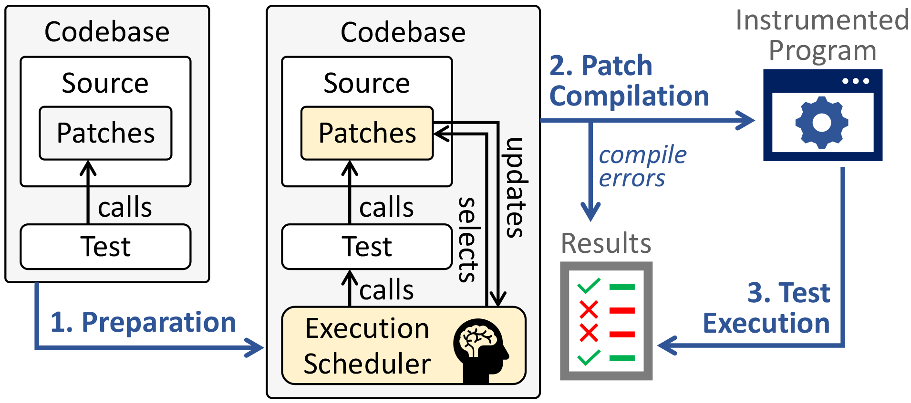
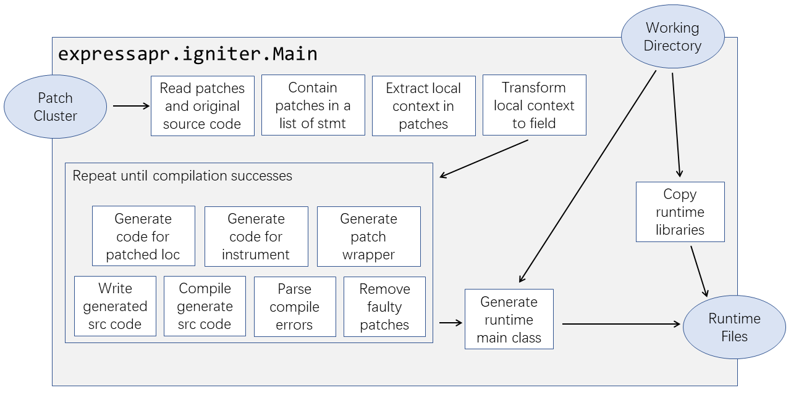
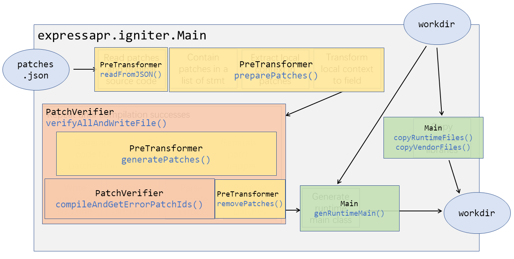
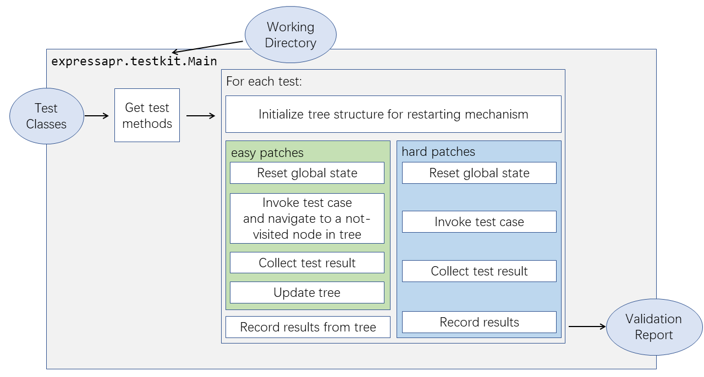
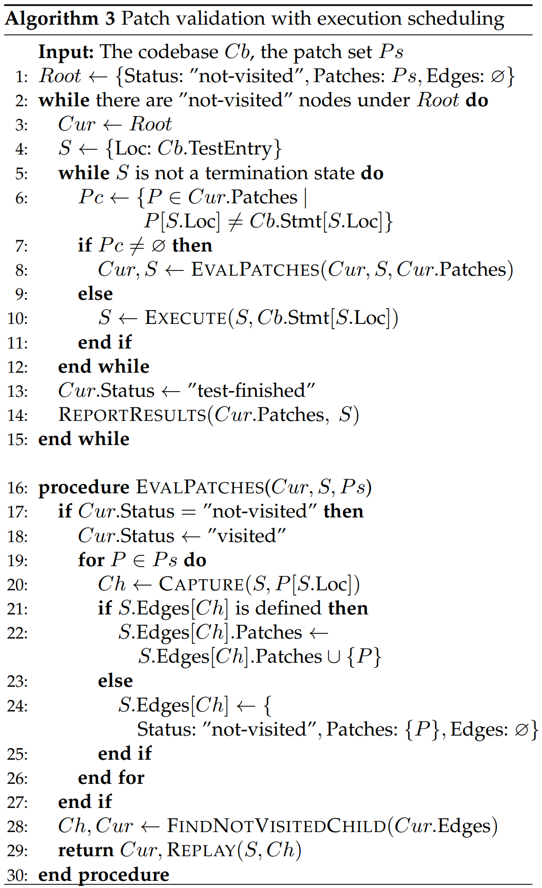

# Design and Structure of ExpressAPR Implementation

The workflow of ExpressAPR can be seen as three steps: **preparation**, **patch compilation** and **test execution** step.  

-----

The preparation step and the patch compilation step are implemented in the `expressapr.igniter` package. It weaves all patches into the codebase and injects the execution scheduler runtime files to be executed. Then it compiles the codebase into an executable program. Should there be compile errors, related patches are removed and reported as implausible.

The structure is described below:

Or, if you like to know the class and method name for each part:

-----

The test execution step is implemented in the `expressapr.testkit` package (that is injected into the codebase by preparation step). The structure is described below:

For "easy" patches that are applicable for mutant deduplication, it follows the test execution algorithm as described below. For other "hard" patches, it fallbacks to sequential validation.

